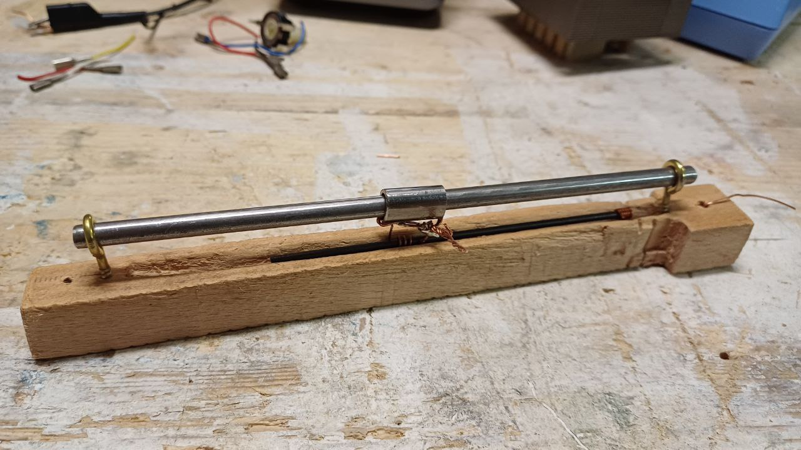
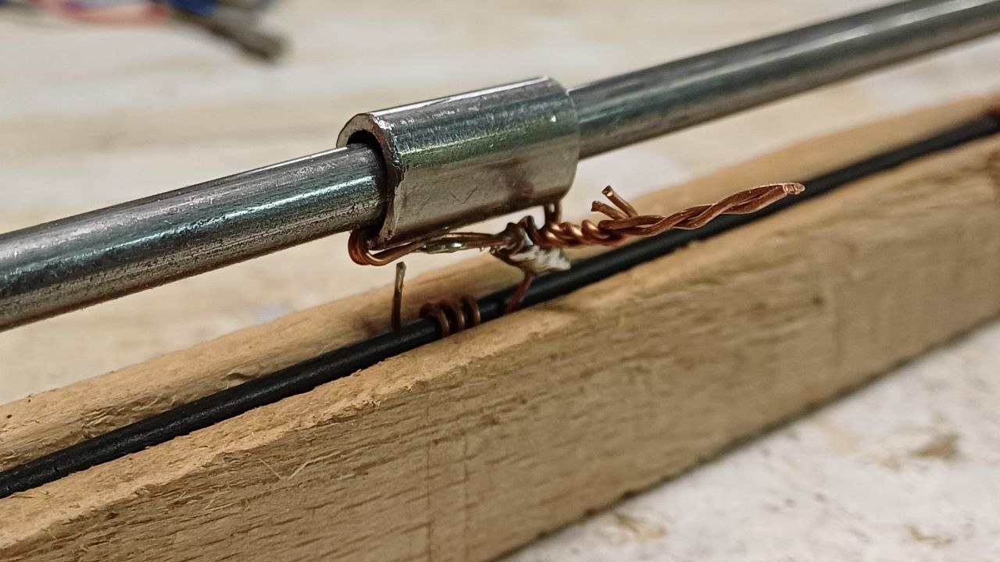
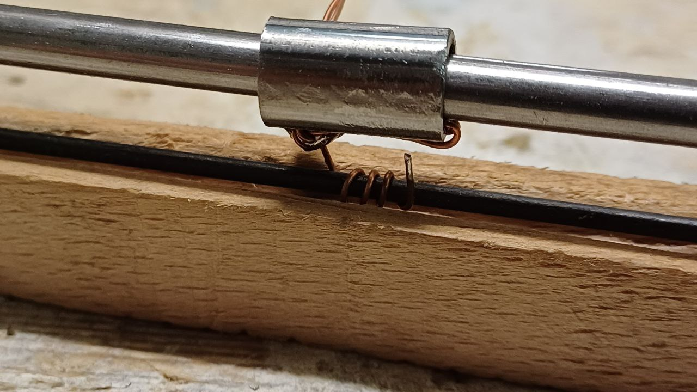
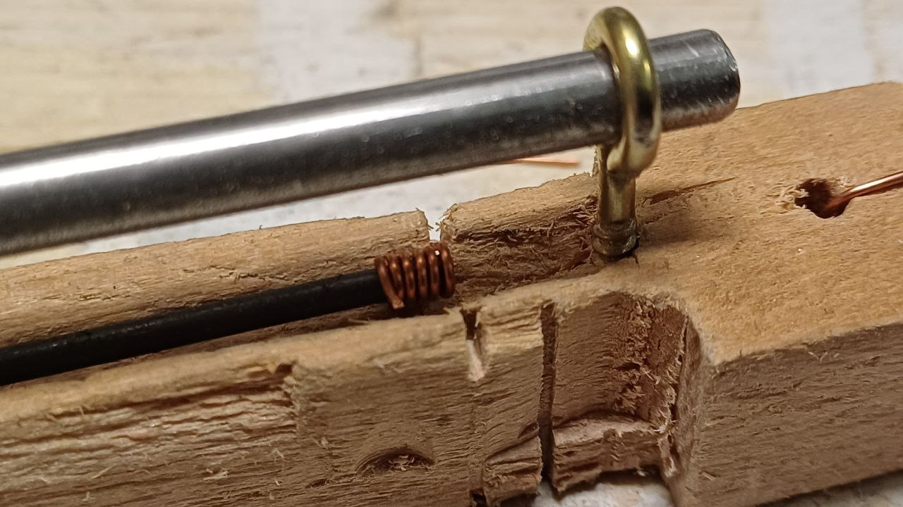
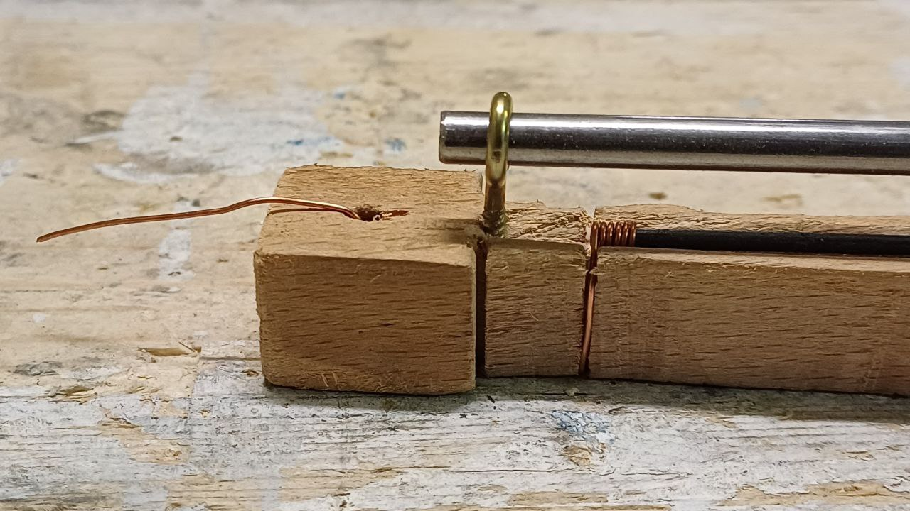

# Graphite Rheostat — Educational Project

This is a handmade rheostat designed for educational purposes, using a **graphite lead** (from a pencil) as the resistive element and a **sliding contact** to adjust resistance.

A rheostat is a variable resistor that adjusts current by changing the length of the resistive path. This model uses a graphite pencil lead instead of the traditional wire coil and a sliding copper contact moves along the graphite, varying resistance between two terminals.

Historically, rheostats were common in early electrical labs, lighting controls, and motor speed regulation and unlike a potentiometer (three terminals, voltage divider), a rheostat uses two terminals to directly control current.

Curiosity: There are still locomotives that uses a rehostat to control their engine speed such as the legendary **FS Class E.656** or the **FS Class E.632** both still in use in the italian railways.

## 1) Overview
A graphite lead is fixed in a groove in a wooden base. One end of the graphite is connected to the **input terminal**. A slider runs along a guide rod and carries a small loop made from copper wire that slightly penetrates the graphite, ensuring stable contact. The slider output is the **variable terminal**.

Moving the slider closer to the input decreases resistance; moving it away increases resistance.







## 2) Materials
- Wooden strip (base)
- Two screw eyes (to hold the guide rod)
- Steel rod (guide for the slider)
- Slider with copper wire loop (contact) and output wire
- Graphite lead (from a pencil/lead holder)
- Copper wire for connections
- Optional: spring for constant pressure, graduated scale

## 3) Principle of Operation
The graphite lead behaves as a resistive element. The resistance between the fixed terminal and the slider is proportional to the length of graphite between them.

Formula:
```
R = ρ * L / A
```
Where:
- ρ = resistivity of graphite
- L = length of the active section of graphite
- A = cross-sectional area of the graphite

## 4) Measuring and Calibration
Since ρ varies depending on graphite type, measure it by:
1. Taking a piece of known length L₀
2. Measuring its total resistance R₀
3. Calculating ρ = R₀ * A / L₀

With ρ known, you can predict resistance for different slider positions.

## 5) Safety and Limitations
- Not suitable for high currents — graphite can overheat and break.
- Keep away from moisture and dust to ensure stable resistance.
- Use low voltages for experiments.
